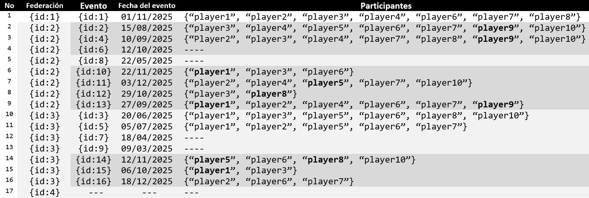

# 🧩 Control Check 2 – Group G2 (English version)

> ### ⚠️ You can find the [Spanish version here](README.md)

## 🧾 Statement

In this exercise, we will add functionality for the **management of regulations and sanctions applied to chess events**.  
Specifically, a `ChessEvent` class is provided, which represents each official chess event organized by a federation (`Federation`). The category of the organized event is indicated using the `EventCategory` enumeration. Events may have referees (`Referee`) assigned, and these referees are certified by a federation. Each federation defines a set of official rules (`Rule`) under which its events must be governed, from which each event may apply its own subset of rules (`applies`). When a rule is not complied with, a sanction (`Sanction`) is applied, which is imposed by a referee on a participant of the event (`User`). The `SanctionType` enumeration is provided to indicate the types of sanctions.

The UML diagram that describes the classes and relationships we will work with is the following:


The classes for which we will perform object-relational mapping as JPA entities are highlighted in **red**. The classes in **blue** are already provided as mapped classes, but they will be used during the lab control.


## 🧪 Instructions

The first task in this control is to clone this repository. If you are using the classroom computers, you will need to use a GitHub authentication token as your password. The repository itself includes a [help document](Guía para uso de computadoras del laboratorio.pdf) explaining how to configure this token. Next, you must import the project into your preferred development environment and start working on the exercises detailed below. 

The functionality implemented in each exercise will be validated using unit tests. The tests can be run from your IDE or by using:

```bash
./mvnw test
```
Each exercise is worth **2 points**. The number of test cases vary from one exercise to the other. Your score for each exercise depends on the percentage of passing tests. For instance:

| Test Success | Score |
|---------------|--------|
| 100% | 2.0 |
| 50% | 1.0 |
| 10% | 0.2 |


### 📤 Submission

The submission of the control check will be carried out in **two steps:**
1.	**Submit the activity in the EV platform associated with the control check, providing as text the URL of your personal repository.** You can do this at the beginning of the session.
2.	**Perform a single git push to your individual repository** (the one containing this document) once you have completed all the exercises.

Remember that **you must push your work before logging out of the computer and leaving the classroom;** otherwise, your attempt will be graded as not submitted.


### ⚠️ Important Notes

1. **Do not change class names, method names, return types, or parameters.**  
   Tests rely on exact signatures.
2. **Do not modify unit tests.**  
   Local edits to unit tests will be ignored; your repo will be re-tested from scratch.
3. As long as exercises remain incomplete, **some tests will fail** — this is expected. 
   Only projects with a grade of 10 points run all tests without failing.
4. **Git usage is part of your grade.** You cannot ask for support in using git or GitHub.
5. Projects that **do not compile or fail to start Spring** will receive **0 points**.
6. Except for **Exercise 5** (depends on 4), exercises are **independent**. You can solve them in any order.

---

## 🧩 Exercise 1 — Create the `Referee` and `Sanction` entities, their repositories, and relationships

### Part 1.a — Entities and repositories (1 point)

Modify the classes `Referee` and `Sanction` so that they become **JPA entities**. Both classes are located in `es.us.dp1.chess.federation.regulation`

#### `Referee` attributes

- `id` (`Integer`): **primary key** of the entity.
- `name` (`String`): length **between 3 and 50 characters** (inclusive).
- `licenseNumber` (`String`, mandatory): cannot be empty, **must not contain only whitespace**, must have **exactly 10 characters**.
- `certificationDate` (`LocalDate`, mandatory): the date on which the referee was certified.

#### `Sanction` attributes

- `id` (`Integer`): **primary key** of the entity.
- `description` (`String`, mandatory): cannot be empty, **must not contain whitespace**, length **between 15 and 70 characters** (inclusive).
- `type` (`SanctionType`, mandatory): indicates the sanction type and must be stored as a **string** in the database: `'WARNING'`, `'PENALTY_TIME'`, `'MATCH_LOST'`, `'EXPULSION'`
- `monetaryFine` (`double`, optional): monetary amount to be paid (if present, it must be **greater than 0**).

#### Repositories

Update the interfaces `RefereeRepository` and `SanctionRepository` (also in `es.us.dp1.chess.federation.regulation`) so that they **extend `CrudRepository`**, specifying the correct generic types.

> ⚠️ **Do not modify** any `@Transient` annotations yet (leave them as they are for now).


### Part 1.b — Entity relationships (1 point)

Now remove the `@Transient` annotations from the attributes and methods that currently have them in `Referee` and `Sanction`, and create the following **unidirectional** relationships, as shown in the UML diagram.

#### Relationships from `Referee` (unidirectional)

- `certifiedBy` → `Federation`
- `assignedTo` → `ChessEvent`

#### Relationships from `Sanction` (unidirectional)

- `imposedBy` → `Referee`
- `imposedOn` → `User`
- `ruleBroken` → `Rule`

Make sure each relationship matches the UML cardinality. For example, some attributes may be nullable because their cardinality is 0..n, while others must not be null because their navigable end of the relationship has a cardinality of 1..n.

## 🧩 Exercise 2 – Modification of the database initialization script (2 points)

Modify the **database initialization script** so that it inserts the referees (`Referee`) and sanctions (`Sanction`) described below, and correctly establishes their relationships.

### Referees

#### Referee 1
```text
Id: 1
Name: “John Peterson”
License number: “REF2025001”
Certification date: January 6, 2000
```
- Certified by the federation with id 2 (`Federation`).

#### Referee 2
```text
Id: 2
Name: “María González”
License number: “REF2025002”
Certification date: December 14, 1998
```
- Certified by the federation with id 3 (`Federation`).

### Sanctions

#### Sanction 1
```text
Id: 1
Description: 'Unsportsmanlike conduct. Disrespect toward an opponent.'
Monetary fine: 500.0
Sanction type: 'EXPULSION'
```
- Imposed by the referee with id 2 (`Referee`).
- Imposed on the player with id 9 (`User`).
- Applied for breaking the rule with id 36 (`Rule`).

#### Sanction 2
```text
Id: 2
Description: 'The player arrived late to the playing area.'
Sanction type: 'WARNING'
```
- Imposed by the referee with id 1 (`Referee`).
- Imposed on the player with id 6 (`User`).
- Applied without being associated with any rule.

**Additionally**, you must register referees (`Referee`) to chess events as follows (`ChessEvent`):
- Events with ids 3 and 4 have referees with ids 1 and 2 assigned.
- Events with ids 5 and 6 have the referee with id 1 assigned.
- Event with id 7 has the referee with id 2 assigned.

> ⚠️ **Remember:** the order of insertions matters in the database initialization script, especially when inserting data that involves relationships between entities.

## 🧩 Exercise 3 – Creation and modification of a controller and frontend component for visualizing the historical record of chess events

### Part 3.a – Controller for querying the historical record of a federation's events (1 point)

Modify `HistoricalRecordController` so that it handles **GET** requests at:

```text
http://localhost:8080/api/v1/federation/{idFederation}/records
```

To do this, the controller must use the federation management service (`FederationService`) and the event management service (`ChessEventService`).

The endpoint must return: 
- the data of the requested federation as a string
(`<name> - <acronym>`), 
- the names of the events of that federation, 
- the participants (`<username>`) of each event.

It must follow the following format:

```json
{
  "federationData": "European Chess Union - ECU",
  "events": [
    {
      "eventName": "European Rapid Championship 2025",
      "participants": ["player3", "player4", "player5", "player6", "player7", "player9", "player10"]
    },
    ...
    {
      "eventName": "European Coaching & Strategy Forum 2025",
      "participants": null
    }
    ...
  ]
}
```

**Additional requirements:**
- This endpoint must be accessible only to users of type ADMIN. 
- If the federation whose historical record of events is requested does not exist, it must return the status code *404 (NOT_FOUND)*.

### Part 3.b – React component for displaying the historical record (1 point)

Modify the provided React component located at `frontend/src/federations/records/index.js` so that it displays the list of events of a federation and the participants of each event.

This component must receive a property called `id`, which is the identifier of the federation whose historical record of events should be displayed.

To obtain the information, it must use the API by sending a GET request to the URL `api/v1/federation/{idFederation}/records`. It is recommended to use the `fetch` function to perform this request, avoiding the use of `axios` or equivalent.

After the API call, the component must display:
- the federation data (`<name> - <acronym>`) as a level 1 title (`<h1>`)
- a table (`<table>`) that includes:
    - one column for the event name called Event name
    - another column for the event participants called Participants. For this, the component must display in the associated cell an unordered list (`<ul>`) with the usernames of the participants in each event.

> To run this test and check its result, you may navigate to the frontend folder and execute the command `npm test`, then press 'a' in the jest command menu. Note that you must have previously run the `npm install` command at least once so that all Node libraries are installed.

## 🧩 Exercise 4 — Add a complex query to `ChessEventRepository` and expose it in the service (2 points)

Modify the custom query used by the method: `findUsersWithLowUpcomingParticipations(...)` located in `ChessEventRepository` (`es.us.dp1.chess.federation.regulation`)

The method receives three parameters:

1. `federations`: a **set of federations** (collection of `Federation`)
2. `date`: a **start date** from which events should be considered (events **after** this date)
3. `numParticipations`: an **integer** representing the *minimum* number of participations

**Goal**

Return **all users (`User`)** who have participated **fewer times than `numParticipations`** in events **organized by** any federation in `federations` with a **date strictly greater than** `date`

This is intended to identify users who are registered but have **low participation in upcoming events**, so marketing campaigns can encourage participation.

For instance, If the method is called with:

- `federations = {2, 3, 4}`
- `date = '01-08-2025'`
- `numParticipations = 4`

Then the result should be the set of users who appear in **fewer than 4** qualifying events (i.e., events organized by federations 2, 3, or 4, and with date after `01-08-2025`).

According to the provided example (see image below), the expected users are:

- `player1` (3 participations)
- `player5` (2 participations)
- `player8` (2 participations)
- `player9` (3 participations)



Note that only events that match **both** conditions (federation in the set **and** date after the given date) must be counted. These events are highlighted in darker grey in the image.

Finally, create a method in the `ChessEventService` class called `getUsersWithLowUpcomingParticipations` that receives the parameters `federations`, `date`, and `numParticipations` (in that order), so that it calls the repository method and returns the result obtained by it.


## 🧩 Exercise 5 – Write tests for the federation event periodicty validation algorithm (2 points)

Chess federations want to ensure that their official chess events (`ChessEvent`) are not scheduled **too close to each other in time**.

For this purpose, an algorithm has been defined that receives the following parameters:
- The *new event* (`ChessEvent`) to be registered.
- The *last registered event* (`ChessEvent`) with which it must be compared.
- The *minimum number of days* that must exist between both events.

The algorithm must check that the difference in days between the last registered event and the new event is strictly greater than the number of days given as a parameter.
- If the events belong to the same category and federation and the difference in days between them is less than or equal to the indicated value, it must throw an exception of type `InvalidPeriodicityForANewChessEvent`.
- In any other case, no exception must be thrown.

The algorithm interface is defined in `PeriodicityEventsAlgorithm`, located in the package `es.us.dp1.chess.federation.regulation.periodicity`. Six implementations of this interface are provided: one correct and five incorrect.

**Task to be performed**

Modify the test class `PeriodicityEventsAlgorithmTest`, located in the package `es.us.dp1.chess.federation.periodicity`, and implement as many test methods as you consider necessary to validate the correct behavior of the algorithm.

The test class has an attribute of type `PeriodicityEventsAlgorithm` called `algorithm`, which must be used as the subject under test in all tests. It also provides a method called `createEvent`, which you may use to easily create instances of `ChessEvent`.

Your test implementation **must not use mocks, Spring test annotations (@DataJpaTest, @SpringBootTest, etc.), nor parameterized tests**, and all methods annotated with @Test must have no parameters.

---


<div align="center">
<b>Design and Testing I — December, 2025</b>
</div>