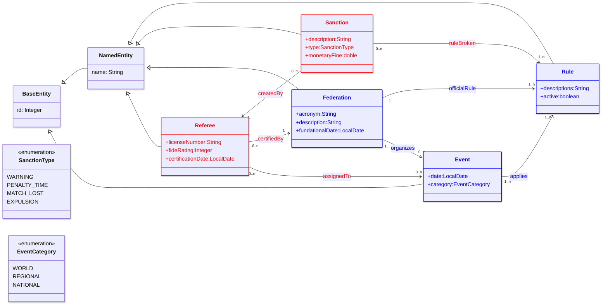

```mermaid

---
config:
  layout: dagre
  look: neo
---
classDiagram
direction LR

  class BaseEntity {
    id: Integer
  }

  class NamedEntity {
    name: String
  }

  class Referee {
    +licenseNumber:String
    +fideRating:Integer
    +certificationDate:LocalDate
  }

  class Sanction {
    +description:String
    +type:SanctionType
    +monetaryFine:doble
  }

  class SanctionType {
    WARNING
    PENALTY_TIME
    MATCH_LOST
    EXPULSION
  }

  class Event {
    +date:LocalDate
    +category:EventCategory
  }

  class Federation {
    +acronym:String
    +description:String
    +fundationalDate:LocalDate
  }

  class Rule {
    %%+name:String
    +descriptions:String
    +active:boolean
  }

  class EventCategory {
    WORLD
    REGIONAL
    NATIONAL
  }

  <<enumeration>> SanctionType
  <<enumeration>> EventCategory

  BaseEntity <|-- NamedEntity
  NamedEntity <|-- Rule
  NamedEntity <|-- Sanction
  
  NamedEntity <|-- Federation 
  BaseEntity <|-- Event
  NamedEntity <|-- Referee
  
  Referee "1" <-- "0..n" Sanction : <font color='red'>createdBy</font>
  Referee "0..n" --> "1" Federation : <font color='red'>certifiedBy</font>

  

  Referee "0..n" --> "0..n" Event : <font color='red'>assignedTo</font> 
  
  
  Federation "1" --> "1..n" Rule : <font color='blue'>officialRule</font>

  Federation "1" --> "0..n" Event : <font color='blue'>organizes</font>
  
  Event "1..n" --> "1..n" Rule : <font color='blue'>applies</font>

  Sanction "0..n" --> "1..n" Rule : <font color='red'>ruleBroken</font>

  style Referee stroke:red,color:red
  style Sanction stroke:red,color:red
  style Player stroke:blue,color:blue
  style Event stroke:blue,color:blue
  style Federation stroke:blue,color:blue
  style Rule stroke:blue,color:blue


```