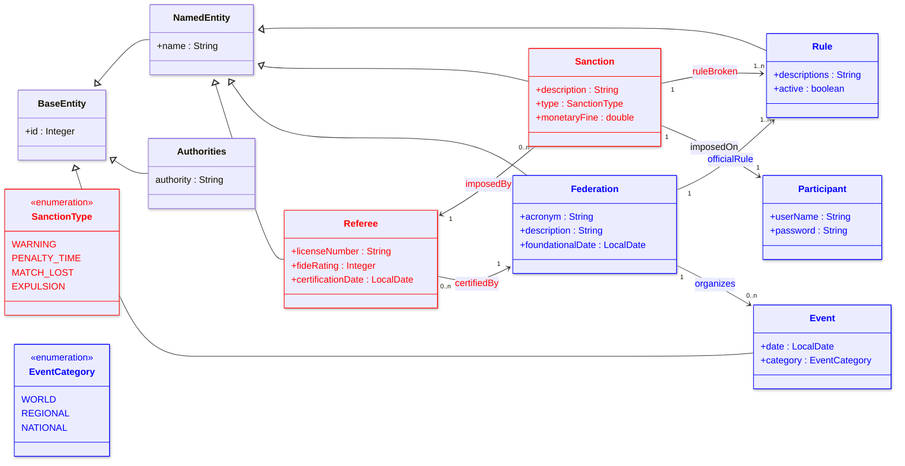

```mermaid

---
config:
  layout: dagre
  look: neo
---
classDiagram
direction LR

    class BaseEntity {
        +id : Integer
    }

    class NamedEntity {
        +name : String
    }

    class Event {
        +date : LocalDate
        +category : EventCategory
    }

    class Federation {
        +acronym : String
        +description : String
        +foundationalDate : LocalDate
    }

    class Referee {
        +licenseNumber : String
        +fideRating : Integer
        +certificationDate : LocalDate
    }

    class Rule {
        +descriptions : String
        +active : boolean
    }

    class Sanction {
        +description : String
        +type : SanctionType
        +monetaryFine : double
    }

    class Participant {
        +userName : String
        +password : String
    }

    class Authorities {
        authority : String
    }

    %% Enumerations
    class SanctionType {
        <<enumeration>>
        WARNING
        PENALTY_TIME
        MATCH_LOST
        EXPULSION
    }

    class EventCategory {
        <<enumeration>>
        WORLD
        REGIONAL
        NATIONAL
    }

    BaseEntity <|-- NamedEntity
    BaseEntity <|-- Authorities
    NamedEntity <|-- Rule
    NamedEntity <|-- Sanction

    NamedEntity <|-- Federation
    BaseEntity <|-- Event
    NamedEntity <|-- Referee

    Referee "1" <-- "0..n" Sanction : <font color='red'>imposedBy</font>
    Referee "0..n" --> "1" Federation : <font color='red'>certifiedBy</font>
    %%
    Federation "1" --> "1..n" Rule : <font color='blue'>officialRule</font>
    Federation "1" --> "0..n" Event : <font color='blue'>organizes</font>

    Sanction "1" --> "1..n" Rule : <font color='red'>ruleBroken</font>

    Sanction "1" --> "1" Participant : imposedOn

  style Referee stroke:red,color:red
  style Sanction stroke:red,color:red
  style Participant stroke:blue,color:blue
  style Event stroke:blue,color:blue
  style Federation stroke:blue,color:blue
  style Rule stroke:blue,color:blue
  style EventCategory stroke:blue,color:blue
  style SanctionType stroke:red,color:red

```